# Smith Lawn Games Website


This project creates a marketing website for Smith Lawn Games, a real company which offers lawn games for hire for weddings and other events. It is designed to be responsive and accessible on a range of devices, making it easy to navigate for potential customers.

[View the live project here](https://nicksmith100.github.io/milestone-project-1/)


## User Experience (UX)

### Goals

- #### Visitor Goals

  - As a **First Time Visitor**, I want to:

    1. Find out what services the company offers and at what price
    2. Find the company's social media links to ensure that the company is trustworthy and has a good reputation
    3. Easily navigate throughout the site to find the information I need

  - As a **Returning Visitor**, I want to:

    1. Find detailed information about the services offered, including terms and conditions
    2. Learn more about the background of the company
    3. Make a booking

- #### Business Goals

  - As a **Business**, we want to:

    1. Increase the reach of the company beyond social media platforms
    2. Demonstrate legitimacy, professionalism and trust
    3. Attract bookings

### Design

- #### Wireframes

  - Wireframes were created using the Figma platform, and can be viewed directly here: [Figma - Smith Lawn Games](https://www.figma.com/file/ZwVZsGR4zrrJxL9LcejJ8c/Smith-Lawn-Games?type=design&node-id=0%3A1&t=7b00DC5arYDxJVfg-1).

  - ##### Desktop Wireframes

    

  - ##### Mobile Wireframes

    

  - Only desktop and mobile wireframes were created, the expectation being that tablets in landscape mode would adopt the desktop layout, while tablets in portrait mode would adopt the mobil layout. In reality, the use of [Bootstrap's grid system](https://getbootstrap.com/docs/5.3/layout/grid/) means that the layout is more responsive, providing various layouts at different device breakpoints (more on this in the **Layout and Styling** section below). Nevertheless, the wireframes provided a useful reference to keep the overall layout of the site on track.

  - While the overall structure of the site stays true to the wireframes, there are some notable differences in the final page designs which came about for both business and UX reasons:

    - To provide more choice to the customer, rather than offering packages of specific games, the company decided to categorise the games into "tiers" and offer packages coomprising different numbers of games from each tier. Therefore, on the homepage the different packages are displayed in stylised boxes (similar to Monopoly cards) with a description of their contents - and these weren't included in the original wireframes. The games are then displayed beneath in their different tiers, each tier including a slideshow of images and description of the games - akin to the intended layout of the packages as shown in the wireframes.

    - Since the company only has limited photos of the games, and these are already in use on the homepage, a separate gallery page would not have added any value. Therefore the gallery page does not feature in the final design, but may be added once the company has more candid photos of the games in use during events.

    - A "Booking" link was added to the navigation menu, and the "Book Now" button was moved from the header into the main content section on the homepage only. These both link to the booking page, with the "Book Now" button appearing alongisde the packages on the homepage and acting as a call-to-action.

- #### Layout and Styling

  - The site uses the [Bootstrap 5.3 Grid system](https://getbootstrap.com/docs/5.3/layout/grid/) to ensure it is fully responsive on all device and viewport sizes. Bootstrap 5.3 uses the following [breakpoints](https://getbootstrap.com/docs/5.3/layout/breakpoints/), the shorthand references for which are used throughout the rest of this document:
    
    | Breakpoint        | Shorthand   | Dimensions |
    |-------------------|-------------|------------|
    | Extra small       | xs          | <576px     |
    | Small             | sm          | ≥576px     |
    | Medium            | md          | ≥768px     |
    | Large             | lg          | ≥992px     |
    | Extra large       | xl          | ≥1200px    |
    | Extra extra large | xxl         | ≥1400px    |
  
  - In addition, the site uses the following specific components from the Bootstrap library:
    - The header utilies Bootstrap's [Navbar](https://getbootstrap.com/docs/5.3/components/navbar/), collapsing to a hamburger menu on xs viewports.
    - The homepage utilises Bootstrap's [Carousel](https://getbootstrap.com/docs/5.3/components/carousel/) for the customer quotes overlaid on the hero image, and for the image galleries of the games.
    - The booking page utilises Bootstrap's [Form classes](https://getbootstrap.com/docs/5.3/forms/overview/).
    - The booking page utilises Bootstrap's [Modal plugin](https://getbootstrap.com/docs/5.3/components/modal/) to display terms and conditions at the press of a button.  
  
  - In the early stages of development I was overriding Bootstrap styles, e.g. to provide custom padding, margins and font-size in pixels. However, as I became more familiar with the Bootstrap toolkit I opted to use its utility classes for [spacing](https://getbootstrap.com/docs/5.3/utilities/spacing/) and [typography](https://getbootstrap.com/docs/5.3/content/typography/), ensuring the layout and font are appropriate to the device in use. 

  - I have also used the Boostrap [Display property](https://getbootstrap.com/docs/5.3/utilities/display/) to toggle the visibility of some components at certain breakpoints. This is used in particular:
    -  In the header, where the separate logo and title are replaced by a combined image and text logo on xs viewports.
    -  In the quotes box overlaid on the hero image on the main page, where the carousel disappears on xs, and a separate carousel with larger font-size is provided for xl viewports and above. (The text size for the quotes carousel was one area where Bootstrap's native responsive styling didn't seem to assist - see **Fixed Bugs** section below.)
    
- #### Colour Scheme

  

  - The site is set on an off-white (#F8F9FA) background, while the main colour used for text, logos and buttons is dark green (#213C3D). On sm viewports and above the off-white background is set within a container on a background of the same dark green. Buttons and links transition to a lighter green (#498082) when hovered over, using an ease-in-out transition for a smooth effect.

  - The dark green colour is chosen to represent grass, while the off-white background is typical of websites for companies which cater to the wedding industry. The light green colour for the hover effect is chosen to complement the main dark green.

- #### Imagery

  - The **logo** is a stylised image of a Jenga-style block tower game, one of the most widely recognised lawn games. On xs viewports an alternative version of the logo is used which includes the name of the company in the Desyrel font, effectively combining the logo and title.
  
    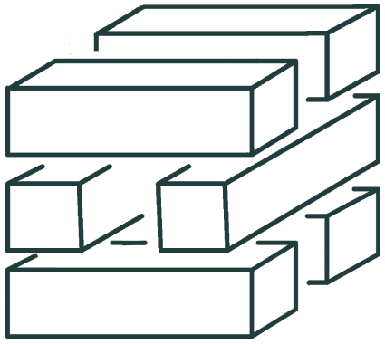 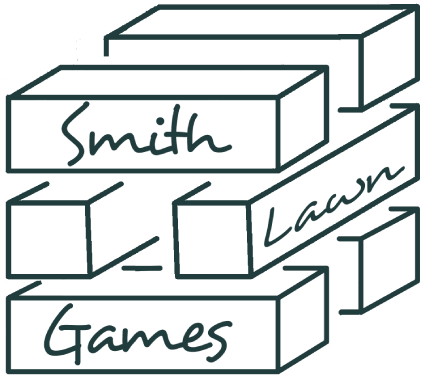

  - The **hero image** on the homepage is a colourful stack of tin cans, showcasing one of the games in use on a sunny summer's day, illustrating the main purpose of the company.

  - The primary image on the About page is of the owners of the company during their own wedding celebrations. This illustrates the origins of the company, complementing the accompanying story and appealing to other couples planning weddings, who are expected to make up the majority of potential customers.

  - The primary image on the Booking page is a notebook surrounded by miscellaneous items, including a pink rose. This ties in with the flowers from the About image, providing a link to the company story given on the About page.
  
  - The primary image on the 404 page is an apparently empty cornfield, complementing the accompanying text which is headed "There's nothing here".
  
  - The hero image and all other primary images fade in for stylistic effect.

- #### Typography

  - ##### Title and navigation

    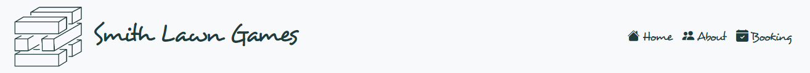

    - The font used for the title and navigation links is Desyrel, with Sans Serif as the fallback font.

    - Desyrel is a playful but stylish script font which reflects that the purpose of the company is to provide fun games.

    - The Desyrel font was downloaded from [Dafont](https://www.dafont.com/desyrel.font) as a TrueType font and converted to @font-face using [Transfonter](https://transfonter.org/).

  - ##### Other headings and text

    

    - The font used throughout the rest of the site is Playfair Display, with Serif as the fallback font.

    - Playfair Display is a classy, stylish serif font which complements the playfulness of the heading font, demonstrating the professionalism of the company.

    - Playfair Display is imported from [Google Fonts](https://fonts.google.com/specimen/Playfair+Display).

- #### Icons

  - Icons are taken from the [Bootstrap Icons](https://icons.getbootstrap.com/) library and are utilised as classes in the `<i>` tag.
  
  - The icons inherit their styling from the anchor and list tags within which they are contained, for example inheriting font-size, color and hover effect.
  
  - Icons are utilised in the header for navigation list items and for the "hamburger" button on smaller viewports, and in the footer for social media links.

- #### Favicon

  - As a favicon, the site uses a simple "S" in the Desyrel font, using the dark green colour against a white background. This proved more effective than trying to use the main logo as a favicon, as the detail of it was lost at such a small size.
  
  - The favicon was generated using [Favicon Generator](https://www.favicon-generator.org/).

## Features

### Scope

- #### Minimum Viable Product

  - To be viable as a marketing website for the company, the website **must have**:
    1. Information on the products available to hire.
    2. Contact details to allow customers to reach the company and make bookings.
         
- #### Additional Features (in scope)

  - To provide a good user experience and meet the stated business needs of the company, the website also **should have**:
    1. Images of the products available to hire.
    2. An online booking form to allow customers to make bookings directly from the site.
    3. An "About page" to allow customers to connect to the origin story of the company.
    4. Quotes from previous customers to add legitimacy and build trust with customers.
    5. Social media links to add legitimacy and allow customers to connect through their preferred platform.
   
 - #### Future Ideas (not currently in scope)
  
    - To provide a better user experience and better meet the business needs of the company, the website also **could have**:
      1. Separate "Book Now" links for each package from the homepage, linking to the booking page while auto-selecting the relevant package from the dropdown menu in the booking form. 
      2. An up-to-date availability calendar, allowing customers to check whether the games are available on their chosen date.
      3. A fully end-to-end booking and payment system, allowing customers to book the games on their chosen date, make payment and receive a confirmation.
      4. A gallery of images from previous events, to add legitimacy and build trust with customers.

### Page Elements

The website includes the following page elements, in line with the scope outlined above. 

- #### All pages

  - ##### Header
         
    - All pages include a header with branding on the left-hand side and a navigation menu on the right-hand side. The header is fully responsive:
      - The title and logo are displayed as a single image on xs viewports.
      - On sm and md viewports, the logo and title are displayed separately with the title being stacked in three lines, while on lg viewports and above, the title displays as a single line.
      - The navigation menu collapses to a hamburger menu on xs viewports, but is otherwise displayed as a single line.
     
     - Desktop header
      
      
    
    - Tablet header
      
      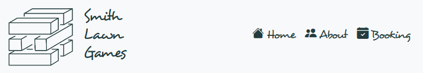
    
    - Mobile header
      
      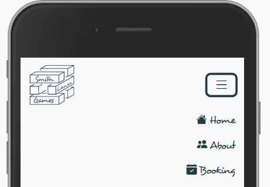
    
  - ##### Primary image
          
    - All pages include a primary image relevant to the content of the page. The image uses [Bootstrap's .img-fluid class](https://getbootstrap.com/docs/5.3/content/images/#responsive-images) to ensure it is fully responsive, stretching across the full width of the viewport for xs viewports, or the full width of the container on sm viewports and above.
    
    - Primary image - desktop
      
      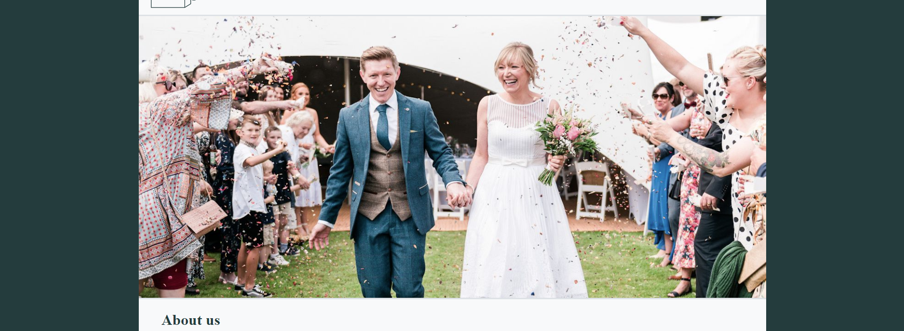
      
    - Primary image - mobile
      
      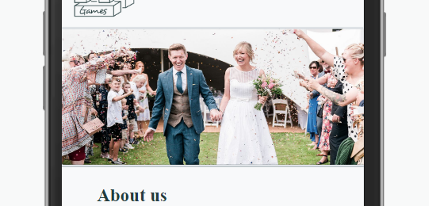
                
  - ##### Footer
       
    - All pages include a footer with three equally spaced and centred social media icons, linking to Instagram, Facebook and Whatsapp. The icons utilise automatic margins so that their spacing is reponsive to the viewport size. 
    
    - Desktop footer
      
      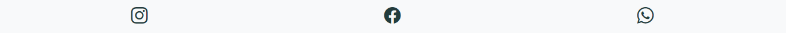
      
    - Mobile footer
      
      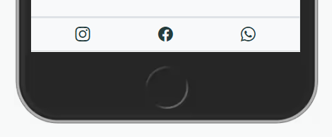 

  - #### Homepage

    - The primary image on the homepage is overlaid with a box on the right-hand side which provides quotes from previous customers on rotation, utilising Bootstrap's [Carousel](https://getbootstrap.com/docs/5.3/components/carousel/) component.
      
      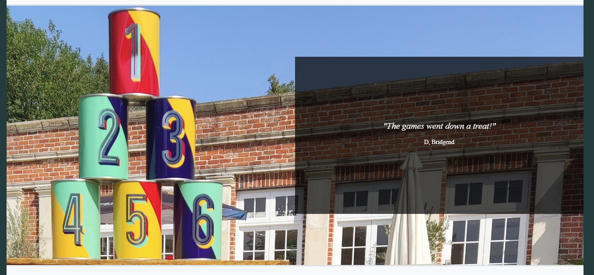
      
    - The quotes box disappears at the xs breakpoint to avoid it dominating the primary image.
      
      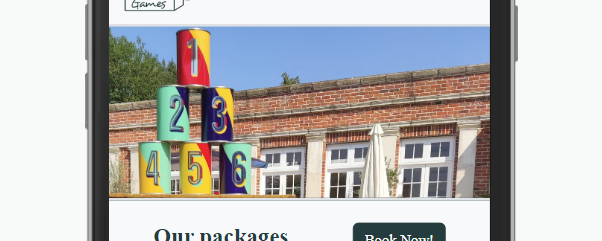
      
    - The main content of the homepage comprises two distinct sections:
      
      - A section outlining the hire packages on offer, each package including a specific number of games from each tier.
      
        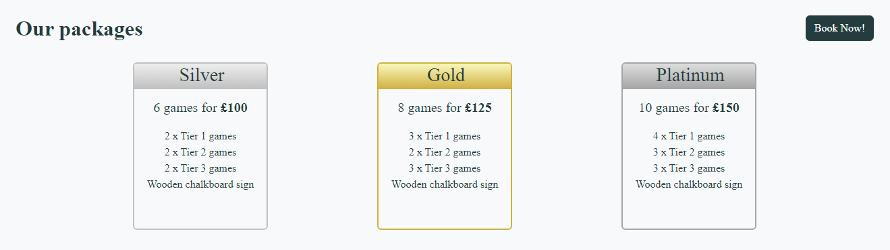
        
        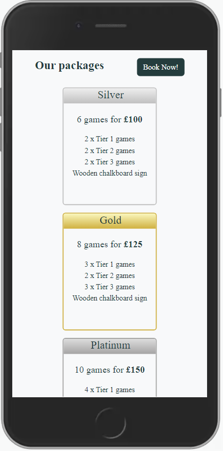
              
      - A section illustrating the games in each tier, including an image gallery for each tier using Bootstrap's [Carousel](https://getbootstrap.com/docs/5.3/components/carousel/) component, and a list of games along with descriptions. The captions for the gallery fade out after 2 seconds to avoid them dominating the images.
        
        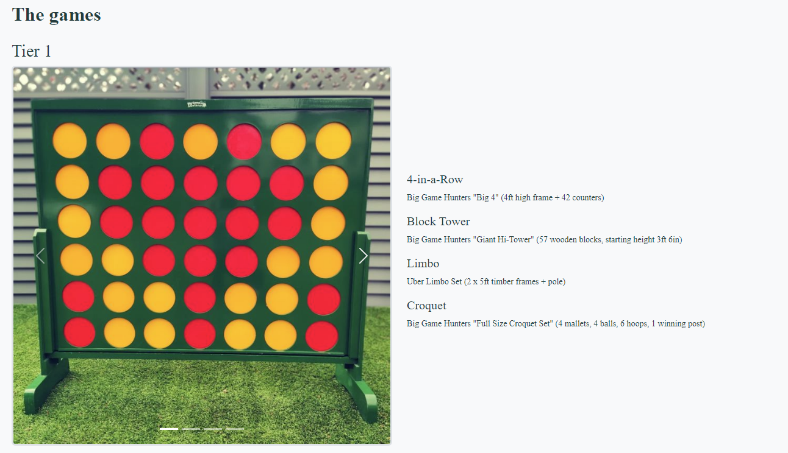
        
        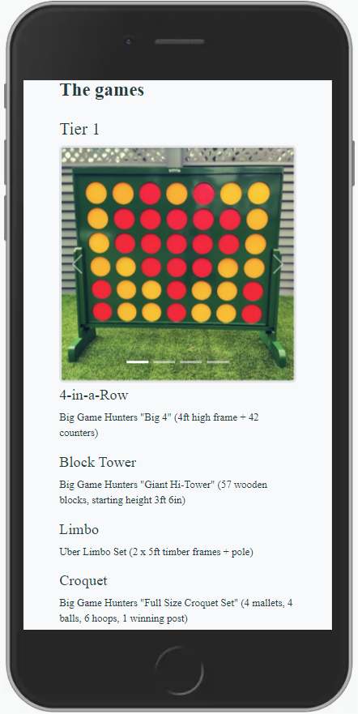
       
      - Both sections utilise Bootstrap's [Grid system](https://getbootstrap.com/docs/5.3/layout/grid/), ensuring that the content adjusts according to viewport size.
      
  - #### About page
      
      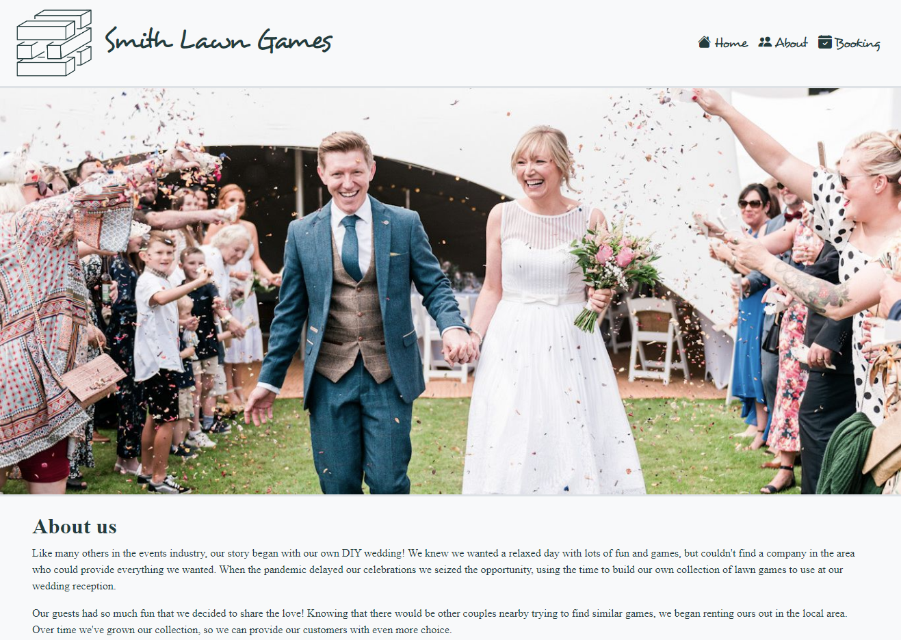
    
    - The About page is the simplest of all the pages with no particular special features. It includes as its primary image a photograph of the owners of the company during their own wedding celebrations, accompanied by the story of how the company began.
                    
  - #### Booking page
  
      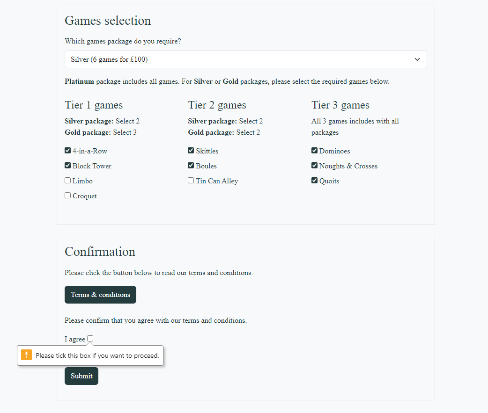
    
    - The Booking page includes a booking form which allows customers to provide their contact details, event details, the package they wish to book and their selected games, and to submit these details to the company.
    - The form is arranged into sections for ease of understanding, and includes required fields which will prevent the form from being submitted unless they are completed.          
    - The form includes a modal to display booking terms and conditions at the press of a button, utilising Bootstrap's [Modal plugin](https://getbootstrap.com/docs/5.3/components/modal/).
      
      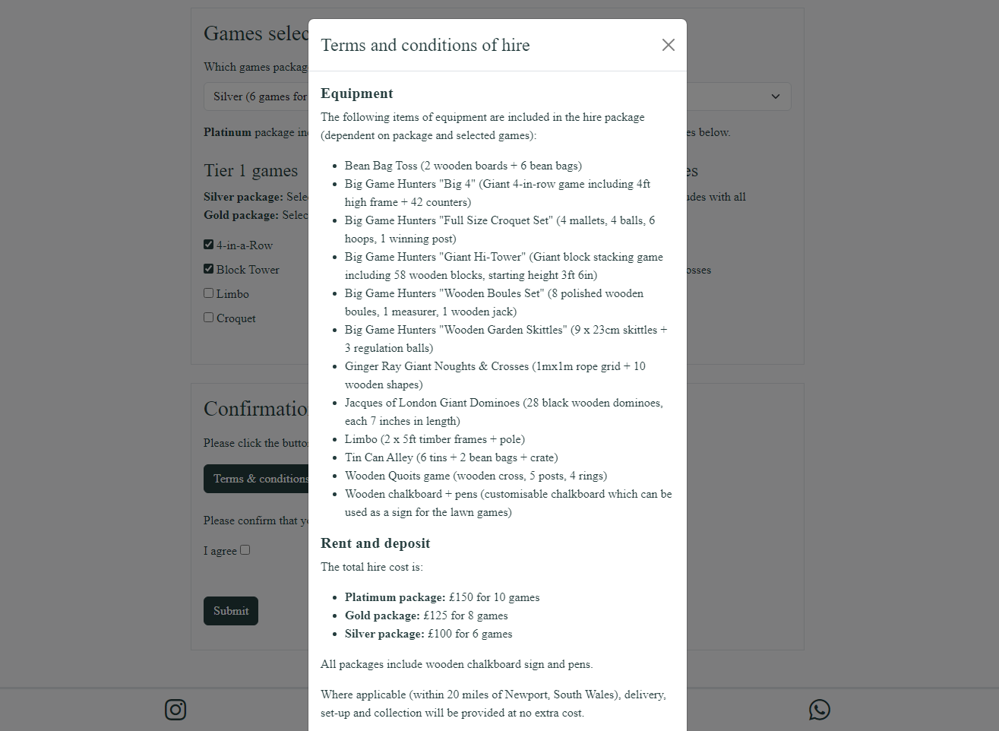

## Technologies Used

### Languages
- [HTML](https://html.spec.whatwg.org/multipage/)
  - Standard markup language for web pages.
- [CSS](https://www.w3.org/Style/CSS/)
  - Used to add style to HTML.

### Frameworks
- [Bootstrap 5.3](https://getbootstrap.com/docs/5.3/getting-started/introduction/)
  - Used for overall layout and styling of page, as well as specific components as described above.

### Libraries
- [Google Fonts](https://fonts.google.com)
  - Used for importing Playfair Display font.
- [Dafont](https://dafont.com/)
  - Used to download Desyrel font. 
- [Bootstrap icons](https://icons.getbootstrap.com/)
  - Used for icons.

### Platforms
- [Github](https://github.com/)
  - Used to store code remotely and for deployment.
- [CodeAnywhere](https://app.codeanywhere.com/)
  - IDE used for project development.

### Other Tools
- [Figma](https://www.figma.com/)
  - Used to create wireframes.
- [Coolors](https://coolors.co/)
  - Used to create colour palette.
- [Transfonter](https://transfonter.org/)
  - Used to convert TrueType font to @font-face 
- [Favicon Generator](https://www.favicon-generator.org/)
  - Used to create the website favicon.
- [Am I Responsive](https://ui.dev/amiresponsive)
  - Used to create montage of different devices displaying the site.

## Testing

### Validation

- [W3C Markup Validator](https://validator.w3.org/) returns no errors against any of the pages. (It does, however, return a minor warning against the booking.html page - see **Known Bugs** section.)
- [W3C CSS Validator](https://jigsaw.w3.org/css-validator/) returns no errors or warnings.

### Manual Testing

- The Website was fully tested on the following browsers and devices, checking that all features and links worked correctly:
  - Google Chrome, Internet Explorer, Microsoft Edge and Safari browsers.
- The website was viewed on a variety of devices such as Desktop, Laptop, iPhone7, iPhone 8 & iPhoneX.
- A large amount of testing was done to ensure that all pages were linking correctly.
- Friends and family members reviewed the site to highlight any bugs and/or user experience issues.

### Fixed

### Known Bugs

- On some mobile devices the Hero Image pushes the size of screen out more than any of the other content on the page.
  - A white gap can be seen to the right of the footer and navigation bar as a result.
- On Microsoft Edge and Internet Explorer Browsers, all links in Navbar are pushed upwards when hovering over them.

## Deployment

### GitHub Pages

The project was deployed to GitHub Pages using the following steps...

1. Log in to GitHub and locate the [GitHub Repository](https://github.com/)
2. At the top of the Repository (not top of page), locate the "Settings" Button on the menu.
   - Alternatively Click [Here](https://raw.githubusercontent.com/) for a GIF demonstrating the process starting from Step 2.
3. Scroll down the Settings page until you locate the "GitHub Pages" Section.
4. Under "Source", click the dropdown called "None" and select "Master Branch".
5. The page will automatically refresh.
6. Scroll back down through the page to locate the now published site [link](https://github.com) in the "GitHub Pages" section.

### Forking the GitHub Repository

By forking the GitHub Repository we make a copy of the original repository on our GitHub account to view and/or make changes without affecting the original repository by using the following steps...

1. Log in to GitHub and locate the [GitHub Repository](https://github.com/)
2. At the top of the Repository (not top of page) just above the "Settings" Button on the menu, locate the "Fork" Button.
3. You should now have a copy of the original repository in your GitHub account.

### Making a Local Clone

1. Log in to GitHub and locate the [GitHub Repository](https://github.com/)
2. Under the repository name, click "Clone or download".
3. To clone the repository using HTTPS, under "Clone with HTTPS", copy the link.
4. Open Git Bash
5. Change the current working directory to the location where you want the cloned directory to be made.
6. Type `git clone`, and then paste the URL you copied in Step 3.

```
$ git clone https://github.com/YOUR-USERNAME/YOUR-REPOSITORY
```

7. Press Enter. Your local clone will be created.

```
$ git clone https://github.com/YOUR-USERNAME/YOUR-REPOSITORY
> Cloning into `CI-Clone`...
> remote: Counting objects: 10, done.
> remote: Compressing objects: 100% (8/8), done.
> remove: Total 10 (delta 1), reused 10 (delta 1)
> Unpacking objects: 100% (10/10), done.
```

Click [Here](https://help.github.com/en/github/creating-cloning-and-archiving-repositories/cloning-a-repository#cloning-a-repository-to-github-desktop) to retrieve pictures for some of the buttons and more detailed explanations of the above process.

## Credits

### Code

- The full-screen hero image code came from this [StackOverflow post](https://stackoverflow.com)

- [Bootstrap4](https://getbootstrap.com/docs/4.4/getting-started/introduction/): Bootstrap Library used throughout the project mainly to make site responsive using the Bootstrap Grid System.

- [MDN Web Docs](https://developer.mozilla.org/) : For Pattern Validation code. Code was modified to better fit my needs and to match an Irish phone number layout to ensure correct validation. Tutorial Found [Here](https://developer.mozilla.org/en-US/docs/Web/HTML/Element/input/tel#Pattern_validation)

### Content

- All content was written by the developer.

### Media

- All Images were created by the developer.

### Acknowledgements

- My Mentor for continuous helpful feedback.

- Tutor support at Code Institute for their support.
