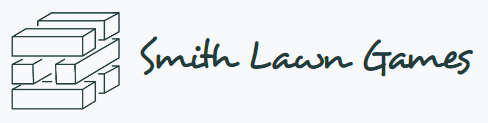
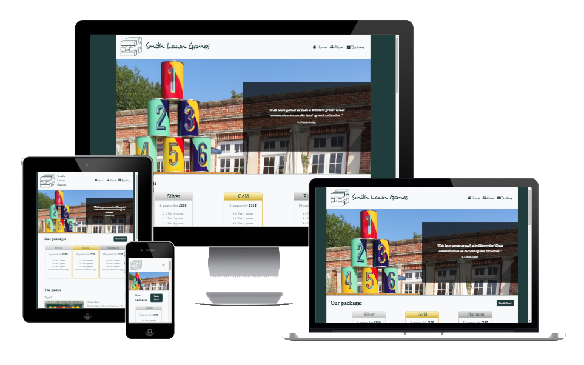
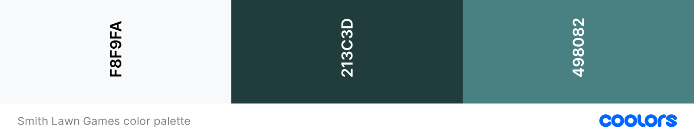
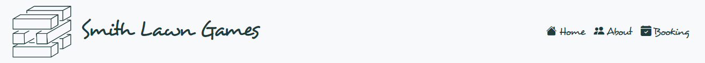
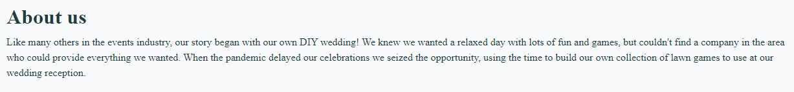
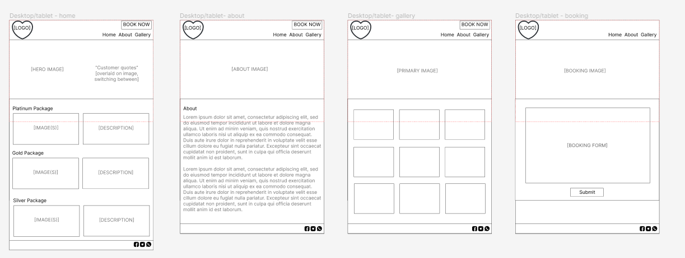
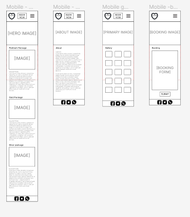

# Smith Lawn Games Website



[View the live project here](https://nicksmith100.github.io/milestone-project-1/)

This project creates a marketing website for Smith Lawn Games, a real company which offers lawn games for hire for weddings and other events. It is designed to be responsive and accessible on a range of devices, making it easy to navigate for potential customers.



## Table of Contents

## User Experience (UX)

### Goals

- #### Visitor Goals

  - As a **First Time Visitor**, I want to:

    1. Find out what services the company offers and at what price
    2. Find the company's social media links to ensure that the company is trustworthy and has a good reputation
    3. Easily navigate throughout the site to find the information I need

  - As a **Returning Visitor**, I want to:

    1. Find detailed information about the services offered, including terms and conditions
    2. Learn more about the background of the company
    3. Make a booking

- #### Business Goals

  - As a business, we want to:

    1. Increase the reach of the company beyond social media platforms
    2. Demonstrate legitimacy, professionalsim and trust
    3. Attract bookings

### Design

- #### Colour Scheme

  

  - The main colour used for text, logos and buttons is dark green (#213C3D), on an off-white (#F8F9FA) background. The dark green is also used for the main background on larger devices, sitting either side of an off-white container. Buttons and links transition to a lighter green (#498082) when hovered over.

  - The dark green colour is chosen to represent grass, while the off-white background is typical of websites for companies which cater to the wedding industry. The light green colour for the hover effect is chosen to complement the main dark green.

- #### Typography

  - ##### Title and navigation

    

    - The font used for the title and navigation links is Desyrel, with Sans Serif as the fallback font.

    - Desyrel is a playful but stylish script font which reflects that the purpose of the company is to provide fun games.

    - The Desyrel font was downloaded from [Dafont](https://www.dafont.com/desyrel.font) as a TrueType font and converted to @font-face using [Transfonter](https://transfonter.org/).

  - ##### Other headings and text

    

    - The font used throughout the rest of the site is Playfair Display, with Serif as the fallback font.

    - Playfair Display is a classy, stylish serif font which complements the playfulness of the heading font, demonstrating the professionalism of the company.

    - Playfair Display is imported from [Google Fonts](https://fonts.google.com/specimen/Playfair+Display).

- #### Imagery

  - The **logo** is a stylised image of a Jenga-style block tower game, one of the most widely recognised lawn games. On smaller devices an alternative version of the logo is used which includes the name of the company in the Desyrel font, effectively combining the logo and title.

  - The **hero image** on the main page is a colourful stack of tin cans, showcasing one of the games in use on a sunny summer's day, illustrating the main purpose of the company.

  - The main image on the "about" page is of the owners of the company during their own wedding celebrations. This illustrates the origins of the company, complementing the accompanying story and appealing to other couples planning weddings, who are expected to make up the majority of potential customers.

  - The main image on the "booking" page is a notebook surrounded by miscellaneous items, including a pink rose. This ties in with the flowers from the "about" image, providing a link to the company story given on the "about" page.

- #### Icons

  - Icons are taken from the [Bootstrap Icons](https://icons.getbootstrap.com/) library and are utilised as classes in the `<i>` tag.
  - The icons inherit their styling from the anchor and list tags within which they are contained, for example inheriting font-size, color and hover effect.
  - Icons are utilised in the header for navigation list items and for the "hamburger" button on smaller devices, and in the footer for social media links.

- #### Wireframes

  - Wireframes were created using the Figma platform, and can be viewed directly here: [Figma - Smith Lawn Games](https://www.figma.com/file/ZwVZsGR4zrrJxL9LcejJ8c/Smith-Lawn-Games?type=design&node-id=0%3A1&t=7b00DC5arYDxJVfg-1).

  - ##### Desktop Wireframes

    

  - ##### Mobile Wireframes

    

  - Only desktop and mobile wireframes were created, the expectation being that tablets in landscape mode would adopt the desktop layout, while tablets in portrait mode would adopt the mobil layout. In reality, the use of [Bootstrap's grid system](https://getbootstrap.com/docs/5.3/layout/grid/) means that the layout is more responsive, providing various layouts at different device breakpoints (more on this below). Nevertheless, the wireframes provided a useful basis for the overall structure of the site.

  - While the overall structure of the site stays true to the wireframes, there are some notable differences in the final page designs which came about for both business and UX reasons:

    - To provide more choice to the customer, rather than offering packages of specific games, the company decided to categorise the games into "tiers" and offer packages coomprising different numbers of games from each tier. Therefore, on the homepage the different packages are displayed in stylised boxes (similar to Monopoly cards) with a description of their contents - and these weren't included in the original wireframes. The games are then displayed beneath in their different tiers, each tier including a slideshow of images and description of the games - akin to the intended layout of the packages as shown in the wireframes.

    - Since the company only has limited photos of the games, and these are already in use on the homepage, a separate gallery page would not have added any value. Therefore the gallery page does not feature in the final design, but may be added once the company has more candid photos of the games in use during events.

    - A "Booking" link was added to the navigation menu, and the "Book Now" button was moved from the header into the main content section on the homepage only. These both link to the booking page, with the "Book Now" button appearing alongisde the packages on the homepage and acting as a call-to-action.

## Features

- Responsive on all device sizes

- Interactive elements

## Technologies Used

### Languages Used

- [HTML5](https://en.wikipedia.org/wiki/HTML5)
- [CSS3](https://en.wikipedia.org/wiki/Cascading_Style_Sheets)

### Frameworks, Libraries & Programs Used

1. [Bootstrap 4.4.1:](https://getbootstrap.com/docs/4.4/getting-started/introduction/)
   - Bootstrap was used to assist with the responsiveness and styling of the website.
1. [Hover.css:](https://ianlunn.github.io/Hover/)
   - Hover.css was used on the Social Media icons in the footer to add the float transition while being hovered over.
1. [Google Fonts:](https://fonts.google.com/)
   - Google fonts were used to import the 'Titillium Web' font into the style.css file which is used on all pages throughout the project.
1. [Font Awesome:](https://fontawesome.com/)
   - Font Awesome was used on all pages throughout the website to add icons for aesthetic and UX purposes.
1. [jQuery:](https://jquery.com/)
   - jQuery came with Bootstrap to make the navbar responsive but was also used for the smooth scroll function in JavaScript.
1. [Git](https://git-scm.com/)
   - Git was used for version control by utilizing the Gitpod terminal to commit to Git and Push to GitHub.
1. [GitHub:](https://github.com/)
   - GitHub is used to store the projects code after being pushed from Git.
1. [Photoshop:](https://www.adobe.com/ie/products/photoshop.html)
   - Photoshop was used to create the logo, resizing images and editing photos for the website.
1. [Balsamiq:](https://balsamiq.com/)
   - Balsamiq was used to create the [wireframes](https://github.com/) during the design process.

## Testing

The W3C Markup Validator and W3C CSS Validator Services were used to validate every page of the project to ensure there were no syntax errors in the project.

- [W3C Markup Validator](https://jigsaw.w3.org/css-validator/#validate_by_input) - [Results](https://github.com/)
- [W3C CSS Validator](https://jigsaw.w3.org/css-validator/#validate_by_input) - [Results](https://github.com/)

### Testing User Stories from User Experience (UX) Section

- #### First Time Visitor Goals

  1. As a First Time Visitor, I want to easily understand the main purpose of the site and learn more about the organisation.

     1. Upon entering the site, users are automatically greeted with a clean and easily readable navigation bar to go to the page of their choice. Underneath there is a Hero Image with Text and a "Learn More" Call to action button.
     2. The main points are made immediately with the hero image
     3. The user has two options, click the call to action buttons or scroll down, both of which will lead to the same place, to learn more about the organisation.

  2. As a First Time Visitor, I want to be able to easily be able to navigate throughout the site to find content.

     1. The site has been designed to be fluid and never to entrap the user. At the top of each page there is a clean navigation bar, each link describes what the page they will end up at clearly.
     2. At the bottom of the first 3 pages there is a redirection call to action to ensure the user always has somewhere to go and doesn't feel trapped as they get to the bottom of the page.
     3. On the Contact Us Page, after a form response is submitted, the page refreshes and the user is brought to the top of the page where the navigation bar is.

  3. As a First Time Visitor, I want to look for testimonials to understand what their users think of them and see if they are trusted. I also want to locate their social media links to see their following on social media to determine how trusted and known they are.
     1. Once the new visitor has read the About Us and What We Do text, they will notice the Why We are Loved So Much section.
     2. The user can also scroll to the bottom of any page on the site to locate social media links in the footer.
     3. At the bottom of the Contact Us page, the user is told underneath the form, that alternatively they can contact the organisation on social media which highlights the links to them.

- #### Returning Visitor Goals

  1. As a Returning Visitor, I want to find the new programming challenges or hackathons.

     1. These are clearly shown in the banner message.
     2. They will be directed to a page with another hero image and call to action.

  2. As a Returning Visitor, I want to find the best way to get in contact with the organisation with any questions I may have.

     1. The navigation bar clearly highlights the "Contact Us" Page.
     2. Here they can fill out the form on the page or are told that alternatively they can message the organisation on social media.
     3. The footer contains links to the organisations Facebook, Twitter and Instagram page as well as the organization's email.
     4. Whichever link they click, it will be open up in a new tab to ensure the user can easily get back to the website.
     5. The email button is set up to automatically open up your email app and autofill there email address in the "To" section.

  3. As a Returning Visitor, I want to find the Facebook Group link so that I can join and interact with others in the community.
     1. The Facebook Page can be found at the footer of every page and will open a new tab for the user and more information can be found on the Facebook page.
     2. Alternatively, the user can scroll to the bottom of the Home page to find the Facebook Group redirect card and can easily join by clicking the "Join Now!" button which like any external link, will open in a new tab to ensure they can get back to the website easily.
     3. If the user is on the "Our Favourites" page they will also be greeted with a call to action button to invite the user to the Facebook group. The user is incentivized as they are told there is a weekly favourite product posted in the group.

- #### Frequent User Goals

  1. As a Frequent User, I want to check to see if there are any newly added challenges or hackathons.

     1. The user would already be comfortable with the website layout and can easily click the banner message.

  2. As a Frequent User, I want to check to see if there are any new blog posts.

     1. The user would already be comfortable with the website layout and can easily click the blog link

  3. As a Frequent User, I want to sign up to the Newsletter so that I am emailed any major updates and/or changes to the website or organisation.
     1. At the bottom of every page their is a footer which content is consistent throughout all pages.
     2. To the right hand side of the footer the user can see "Subscribe to our Newsletter" and are prompted to Enter their email address.
     3. There is a "Submit" button to the right hand side of the input field which is located close to the field and can easily be distinguished.

### Further Testing

- The Website was tested on Google Chrome, Internet Explorer, Microsoft Edge and Safari browsers.
- The website was viewed on a variety of devices such as Desktop, Laptop, iPhone7, iPhone 8 & iPhoneX.
- A large amount of testing was done to ensure that all pages were linking correctly.
- Friends and family members were asked to review the site and documentation to point out any bugs and/or user experience issues.

### Known Bugs

- On some mobile devices the Hero Image pushes the size of screen out more than any of the other content on the page.
  - A white gap can be seen to the right of the footer and navigation bar as a result.
- On Microsoft Edge and Internet Explorer Browsers, all links in Navbar are pushed upwards when hovering over them.

## Deployment

### GitHub Pages

The project was deployed to GitHub Pages using the following steps...

1. Log in to GitHub and locate the [GitHub Repository](https://github.com/)
2. At the top of the Repository (not top of page), locate the "Settings" Button on the menu.
   - Alternatively Click [Here](https://raw.githubusercontent.com/) for a GIF demonstrating the process starting from Step 2.
3. Scroll down the Settings page until you locate the "GitHub Pages" Section.
4. Under "Source", click the dropdown called "None" and select "Master Branch".
5. The page will automatically refresh.
6. Scroll back down through the page to locate the now published site [link](https://github.com) in the "GitHub Pages" section.

### Forking the GitHub Repository

By forking the GitHub Repository we make a copy of the original repository on our GitHub account to view and/or make changes without affecting the original repository by using the following steps...

1. Log in to GitHub and locate the [GitHub Repository](https://github.com/)
2. At the top of the Repository (not top of page) just above the "Settings" Button on the menu, locate the "Fork" Button.
3. You should now have a copy of the original repository in your GitHub account.

### Making a Local Clone

1. Log in to GitHub and locate the [GitHub Repository](https://github.com/)
2. Under the repository name, click "Clone or download".
3. To clone the repository using HTTPS, under "Clone with HTTPS", copy the link.
4. Open Git Bash
5. Change the current working directory to the location where you want the cloned directory to be made.
6. Type `git clone`, and then paste the URL you copied in Step 3.

```
$ git clone https://github.com/YOUR-USERNAME/YOUR-REPOSITORY
```

7. Press Enter. Your local clone will be created.

```
$ git clone https://github.com/YOUR-USERNAME/YOUR-REPOSITORY
> Cloning into `CI-Clone`...
> remote: Counting objects: 10, done.
> remote: Compressing objects: 100% (8/8), done.
> remove: Total 10 (delta 1), reused 10 (delta 1)
> Unpacking objects: 100% (10/10), done.
```

Click [Here](https://help.github.com/en/github/creating-cloning-and-archiving-repositories/cloning-a-repository#cloning-a-repository-to-github-desktop) to retrieve pictures for some of the buttons and more detailed explanations of the above process.

## Credits

### Code

- The full-screen hero image code came from this [StackOverflow post](https://stackoverflow.com)

- [Bootstrap4](https://getbootstrap.com/docs/4.4/getting-started/introduction/): Bootstrap Library used throughout the project mainly to make site responsive using the Bootstrap Grid System.

- [MDN Web Docs](https://developer.mozilla.org/) : For Pattern Validation code. Code was modified to better fit my needs and to match an Irish phone number layout to ensure correct validation. Tutorial Found [Here](https://developer.mozilla.org/en-US/docs/Web/HTML/Element/input/tel#Pattern_validation)

### Content

- All content was written by the developer.

- Psychological properties of colours text in the README.md was found [here](http://www.colour-affects.co.uk/psychological-properties-of-colours)

### Media

- All Images were created by the developer.

### Acknowledgements

- My Mentor for continuous helpful feedback.

- Tutor support at Code Institute for their support.
